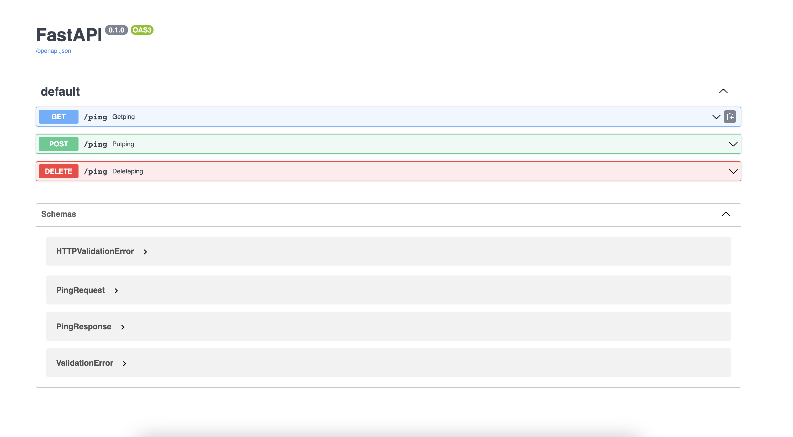
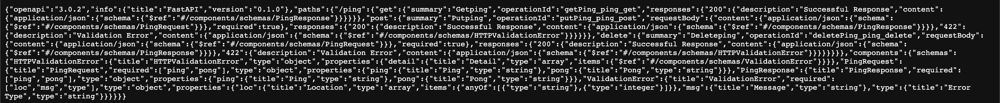

# Motivation
APIs and the developers that build them are everywhere. Even in Sporttrade, 
which is a pretty small company, we have multiple APIs. Each API may have one
or more consumers, which we will call clients, and each API is also under
active developement. 

Let's be frank, new features come in all of the time which might update
or change an endpoint's interface, add a new endpoint, or even deprecate
an old interface. Well that's a lot of changes, do we need to specifically
tell the consumers of these endpoints that they have to go change their
code to accomodate these changes? Well, yes, that would be nice, but there's
got to be an easy way to automate some of this to make their lives easier.

Let's think through a scenario. Let's say we have an iOS engineer developing
an app to house some customer data. It gets and updates customer data
using a REST API. How can we, as DevOps professionals, allow the iOS engineer
to focus on the business logic of the app instead of maintaining the REST client
code each time the API changes (which might be very often)? Enter auto-generated
client libraries!


# Background
Client libraries are collections of code that are specific to some API. By packaging
all of that together into an easily digestible package, the developers can use them
as if they are a black box and they don't have to worry about the details of:

* Sending Web Requests
* Parsing Responses
* Maintaining Custom Exceptions
* etc.

Luckily, we can auto-generate these libraries relatively easily with two things:
1. An OpenAPI Spec
2. Some Tool To Write The Code From The API Spec

So, what's an OpenAPI Spec? Well, [OpenAPI](https://swagger.io/specification/) documents
a standard format, policies, and more for how to document your API. Typically, the spec for
your API will be in either JSON or Yaml format, similar to the JSON below:

```json
{
  "openapi": "3.0.2",
  "info": {
    "title": "FastAPI",
    "version": "0.1.0"
  },
  "paths": {
    "/ping": {
      "get": {
        "summary": "Getping",
        "operationId": "getPing_ping_get",
        "responses": {
          "200": {
            "description": "Successful Response",
            "content": {
              "application/json": {
                "schema": {
                  "$ref": "#/components/schemas/PingResponse"
                }
              }
            }
          }
        }
      },
      "post": {
        "summary": "Putping",
        "operationId": "putPing_ping_post",
        "requestBody": {
          "content": {
            "application/json": {
              "schema": {
                "$ref": "#/components/schemas/PingRequest"
              }
            }
          },
          "required": true
        },
        "responses": {
          "200": {
            "description": "Successful Response",
            "content": {
              "application/json": {
                "schema": {
                  "$ref": "#/components/schemas/PingResponse"
                }
              }
            }
          },
          "422": {
            "description": "Validation Error",
            "content": {
              "application/json": {
                "schema": {
                  "$ref": "#/components/schemas/HTTPValidationError"
                }
              }
            }
          }
        }
      },
      "delete": {
        "summary": "Deleteping",
        "operationId": "deletePing_ping_delete",
        "requestBody": {
          "content": {
            "application/json": {
              "schema": {
                "$ref": "#/components/schemas/PingRequest"
              }
            }
          },
          "required": true
        },
        "responses": {
          "200": {
            "description": "Successful Response",
            "content": {
              "application/json": {
                "schema": {
                  "$ref": "#/components/schemas/PingResponse"
                }
              }
            }
          },
          "422": {
            "description": "Validation Error",
            "content": {
              "application/json": {
                "schema": {
                  "$ref": "#/components/schemas/HTTPValidationError"
                }
              }
            }
          }
        }
      }
    }
  },
  "components": {
    "schemas": {
      "HTTPValidationError": {
        "title": "HTTPValidationError",
        "type": "object",
        "properties": {
          "detail": {
            "title": "Detail",
            "type": "array",
            "items": {
              "$ref": "#/components/schemas/ValidationError"
            }
          }
        }
      },
      "PingRequest": {
        "title": "PingRequest",
        "required": [
          "ping",
          "pong"
        ],
        "type": "object",
        "properties": {
          "ping": {
            "title": "Ping",
            "type": "string"
          },
          "pong": {
            "title": "Pong",
            "type": "string"
          }
        }
      },
      "PingResponse": {
        "title": "PingResponse",
        "required": [
          "ping",
          "pong"
        ],
        "type": "object",
        "properties": {
          "ping": {
            "title": "Ping",
            "type": "string"
          },
          "pong": {
            "title": "Pong",
            "type": "string"
          }
        }
      },
      "ValidationError": {
        "title": "ValidationError",
        "required": [
          "loc",
          "msg",
          "type"
        ],
        "type": "object",
        "properties": {
          "loc": {
            "title": "Location",
            "type": "array",
            "items": {
              "anyOf": [
                {
                  "type": "string"
                },
                {
                  "type": "integer"
                }
              ]
            }
          },
          "msg": {
            "title": "Message",
            "type": "string"
          },
          "type": {
            "title": "Error Type",
            "type": "string"
          }
        }
      }
    }
  }
}
```

Wow! That looks confusing! Where did it come from? Who built it?
Well, that actually came from the API we are going to build together. And don't
worry, I didnt manually write a single piece of that. We are going to use FastAPI
and python to build that together in the next section.

But first, we still have to find a tool that will parse the OpenAPI spec and spit
out a usable client library. Enter the [OpenAPI Generator](https://github.com/OpenAPITools/openapi-generator)!
This is a tool which ingests your spec and spits out a library for a variety of different languages. Some 
languages include Python, Java, Go, Ruby, and the list goes on.

Installing the tool is very easy:

```shell
# Using Wget
wget https://repo1.maven.org/maven2/org/openapitools/openapi-generator-cli/6.3.0/openapi-generator-cli-6.3.0.jar -O openapi-generator-cli.jar

# Using Brew
brew install openapi-generator

# Using Docker
docker pull openapitools/openapi-generator-cli 
```

There are a few other options available in their [README.md](https://github.com/OpenAPITools/openapi-generator).

# Writing the API
So, let's write a simple API using python and FastAPI. This is going to be an extremely
simple API since I don't want to focus too much on the python. First, let's install 
some dependencies. We will need fastapi and uvicorn, which we can install with `pip`:

```shell
pip install fastapi uvicorn
```

Now, we are ready to rock. Our entire API is going to be
less than 30 lines of code:

```python
from fastapi import FastAPI, Request
from pydantic import BaseModel

class PingRequest(BaseModel):
    ping: str
    pong: str

class PingResponse(BaseModel):
    ping: str
    pong: str

app = FastAPI()

@app.get("/ping", response_model=PingResponse)
async def getPing(r: Request):
    return PingResponse(ping="ping", pong="pong")

@app.post("/ping", response_model=PingResponse)
async def postPing(r: Request, ping: PingRequest):
    return PingResponse(ping="ping", pong="pong")

@app.post("/ping", response_model=PingResponse)
async def putPing(r: Request, ping: PingRequest):
    return PingResponse(ping="ping", pong="pong")

@app.delete("/ping", response_model=PingResponse)
async def deletePing(r: Request, ping: PingRequest):
    return PingResponse(ping="ping", pong="pong")
```

So, what is this doing? Let's break it down:

```python
class PingRequest(BaseModel):
    ping: str
    pong: str

class PingResponse(BaseModel):
    ping: str
    pong: str
```

This gives us one request body and one response body, both have the same
format. If we were to JSONify these, they would both look like this:

```json
{ "ping": "some-string", "pong": "some-string" }
```

These will be used for serialization by our API.

Then we instantiate a FastAPI server:

```python
app = FastAPI()
```

Finally, we just make some simple endpoints. All of
them are at `/ping`, and there is a  `GET`, `PUT`, `POST`, `DELETE`
at this `/ping` endpoint:

```python
@app.get("/ping", response_model=PingResponse)
async def getPing(r: Request):
    return PingResponse(ping="ping", pong="pong")

@app.post("/ping", response_model=PingResponse)
async def postPing(r: Request, ping: PingRequest):
    return PingResponse(ping="ping", pong="pong")

@app.post("/ping", response_model=PingResponse)
async def putPing(r: Request, ping: PingRequest):
    return PingResponse(ping="ping", pong="pong")

@app.delete("/ping", response_model=PingResponse)
async def deletePing(r: Request, ping: PingRequest):
    return PingResponse(ping="ping", pong="pong")
```

That's it for the API! Let's recap. We made a server application,
but we didn't write a single line of client library code. 
Let's let someone else write the client library for us...

# Generating the Client Library

We we need to first run the server before generating the 
client library. So let's run our API:

```shell
cd api
poetry run uvicorn app:app --reload
```

To make sure everything is up and running, let's open a browser 
and navigate to a few pages:

* http://127.0.0.1:8000/docs
* http://127.0.0.1:8000/openapi.json

They should look something like the below:




We are going to use the [OpenAPI Generator](https://github.com/OpenAPITools/openapi-generator) to generate
our client libraries for us. It's free, easy to install, and easy to use.

Installing it is as easy as:

```shell
# mac with homebrew
brew install openapi-generator

# linux by downloading the jar
wget https://repo1.maven.org/maven2/org/openapitools/openapi-generator-cli/6.3.0/openapi-generator-cli-6.3.0.jar -O openapi-generator-cli.jar

# running with docker
docker run --rm -v "${PWD}:/local" openapitools/openapi-generator-cli generate \
    -i https://raw.githubusercontent.com/openapitools/openapi-generator/master/modules/openapi-generator/src/test/resources/3_0/petstore.yaml \
    -g go \
    -o /local/out/go
```

Or there's a few other methods on their [installations page](https://github.com/OpenAPITools/openapi-generator#1---installation).

You can do a quick test by running `openapi-generator` on your command line:

```shell
prompt> openapi-generator
usage: openapi-generator-cli <command> [<args>]

The most commonly used openapi-generator-cli commands are:
    author        Utilities for authoring generators or customizing templates.
    batch         Generate code in batch via external configs.
    config-help   Config help for chosen lang
    generate      Generate code with the specified generator.
    help          Display help information about openapi-generator
    list          Lists the available generators
    meta          MetaGenerator. Generator for creating a new template set and configuration for Codegen.  The output will be based on the language you specify, and includes default templates to include.
    validate      Validate specification
    version       Show version information used in tooling
```

Now, let's generate this client library!

The openapi generator takes a few things as input to its cli:

* an input URL. This is the URL to the openAPI json or yaml file. It can also be a path on disk.
* a generator language (python/java/etc.). For a full list of supported generators see [these docs](https://github.com/OpenAPITools/openapi-generator).
* an output directory to store the generated client library.

So the full command might look like:
```shell
_JAVA_OPTIONS="--add-opens=java.base/java.lang=ALL-UNNAMED --add-opens=java.base/java.util=ALL-UNNAMED" openapi-generator generate -i http://127.0.0.1:8000/openapi.json -g python -o ./generated
```

So, let's give this a run:
```shell
prompt> _JAVA_OPTIONS="--add-opens=java.base/java.lang=ALL-UNNAMED --add-opens=java.base/java.util=ALL-UNNAMED" \
  openapi-generator \
  generate \
  -i http://127.0.0.1:8000/openapi.json \
  -g python \
  -o ./generated
Picked up _JAVA_OPTIONS: --add-opens=java.base/java.lang=ALL-UNNAMED --add-opens=java.base/java.util=ALL-UNNAMED
[main] INFO  o.o.codegen.DefaultGenerator - Generating with dryRun=false
[main] INFO  o.o.codegen.DefaultGenerator - OpenAPI Generator: python (client)
[main] INFO  o.o.codegen.DefaultGenerator - Generator 'python' is considered stable.
[main] INFO  o.o.c.l.AbstractPythonCodegen - Environment variable PYTHON_POST_PROCESS_FILE not defined so the Python code may not be properly formatted. To define it, try 'export PYTHON_POST_PROCESS_FILE="/usr/local/bin/yapf -i"' (Linux/Mac)
[main] INFO  o.o.c.l.AbstractPythonCodegen - NOTE: To enable file post-processing, 'enablePostProcessFile' must be set to `true` (--enable-post-process-file for CLI).
[main] INFO  o.o.c.languages.PythonClientCodegen - Environment variable PYTHON_POST_PROCESS_FILE not defined so the Python code may not be properly formatted. To define it, try 'export PYTHON_POST_PROCESS_FILE="/usr/local/bin/yapf -i"' (Linux/Mac)
[main] INFO  o.o.c.languages.PythonClientCodegen - NOTE: To enable file post-processing, 'enablePostProcessFile' must be set to `true` (--enable-post-process-file for CLI).
[main] INFO  o.o.c.languages.PythonClientCodegen - generateAliasAsModel is hard coded to true in this generator. Alias models will only be generated if they contain validations or enums
[main] INFO  o.o.codegen.utils.URLPathUtils - 'host' (OAS 2.0) or 'servers' (OAS 3.0) not defined in the spec. Default to [http://localhost] for server URL [http://localhost/]
[main] INFO  o.o.codegen.utils.URLPathUtils - 'host' (OAS 2.0) or 'servers' (OAS 3.0) not defined in the spec. Default to [http://localhost] for server URL [http://localhost/]
[main] INFO  o.o.codegen.TemplateManager - writing file /Users/alexanderfoley/mycode/openapi-client-libraries/./generated/openapi_client/model/http_validation_error.py
[main] INFO  o.o.codegen.TemplateManager - writing file /Users/alexanderfoley/mycode/openapi-client-libraries/./generated/openapi_client/model/http_validation_error.pyi
[main] INFO  o.o.codegen.TemplateManager - Skipped /Users/alexanderfoley/mycode/openapi-client-libraries/./generated/test/test_models/test_http_validation_error.py (Test files never overwrite an existing file of the same name.)
[main] INFO  o.o.codegen.TemplateManager - writing file /Users/alexanderfoley/mycode/openapi-client-libraries/./generated/docs/models/HTTPValidationError.md
[main] INFO  o.o.codegen.TemplateManager - writing file /Users/alexanderfoley/mycode/openapi-client-libraries/./generated/openapi_client/model/ping_request.py
[main] INFO  o.o.codegen.TemplateManager - writing file /Users/alexanderfoley/mycode/openapi-client-libraries/./generated/openapi_client/model/ping_request.pyi
[main] INFO  o.o.codegen.TemplateManager - Skipped /Users/alexanderfoley/mycode/openapi-client-libraries/./generated/test/test_models/test_ping_request.py (Test files never overwrite an existing file of the same name.)
[main] INFO  o.o.codegen.TemplateManager - writing file /Users/alexanderfoley/mycode/openapi-client-libraries/./generated/docs/models/PingRequest.md
[main] INFO  o.o.codegen.TemplateManager - writing file /Users/alexanderfoley/mycode/openapi-client-libraries/./generated/openapi_client/model/ping_response.py
[main] INFO  o.o.codegen.TemplateManager - writing file /Users/alexanderfoley/mycode/openapi-client-libraries/./generated/openapi_client/model/ping_response.pyi
[main] INFO  o.o.codegen.TemplateManager - Skipped /Users/alexanderfoley/mycode/openapi-client-libraries/./generated/test/test_models/test_ping_response.py (Test files never overwrite an existing file of the same name.)
[main] INFO  o.o.codegen.TemplateManager - writing file /Users/alexanderfoley/mycode/openapi-client-libraries/./generated/docs/models/PingResponse.md
[main] INFO  o.o.codegen.TemplateManager - writing file /Users/alexanderfoley/mycode/openapi-client-libraries/./generated/openapi_client/model/validation_error.py
[main] INFO  o.o.codegen.TemplateManager - writing file /Users/alexanderfoley/mycode/openapi-client-libraries/./generated/openapi_client/model/validation_error.pyi
[main] INFO  o.o.codegen.TemplateManager - Skipped /Users/alexanderfoley/mycode/openapi-client-libraries/./generated/test/test_models/test_validation_error.py (Test files never overwrite an existing file of the same name.)
[main] INFO  o.o.codegen.TemplateManager - writing file /Users/alexanderfoley/mycode/openapi-client-libraries/./generated/docs/models/ValidationError.md
[main] INFO  o.o.codegen.TemplateManager - writing file /Users/alexanderfoley/mycode/openapi-client-libraries/./generated/openapi_client/paths/ping/delete.py
[main] INFO  o.o.codegen.TemplateManager - writing file /Users/alexanderfoley/mycode/openapi-client-libraries/./generated/openapi_client/paths/ping/delete.pyi
[main] INFO  o.o.codegen.TemplateManager - writing file /Users/alexanderfoley/mycode/openapi-client-libraries/./generated/openapi_client/paths/ping/get.py
[main] INFO  o.o.codegen.TemplateManager - writing file /Users/alexanderfoley/mycode/openapi-client-libraries/./generated/openapi_client/paths/ping/get.pyi
[main] INFO  o.o.codegen.TemplateManager - writing file /Users/alexanderfoley/mycode/openapi-client-libraries/./generated/openapi_client/paths/ping/post.py
[main] INFO  o.o.codegen.TemplateManager - writing file /Users/alexanderfoley/mycode/openapi-client-libraries/./generated/openapi_client/paths/ping/post.pyi
[main] INFO  o.o.codegen.TemplateManager - writing file /Users/alexanderfoley/mycode/openapi-client-libraries/./generated/openapi_client/paths/__init__.py
[main] INFO  o.o.codegen.TemplateManager - writing file /Users/alexanderfoley/mycode/openapi-client-libraries/./generated/openapi_client/paths/ping/__init__.py
[main] INFO  o.o.codegen.TemplateManager - writing file /Users/alexanderfoley/mycode/openapi-client-libraries/./generated/openapi_client/apis/tag_to_api.py
[main] INFO  o.o.codegen.TemplateManager - writing file /Users/alexanderfoley/mycode/openapi-client-libraries/./generated/openapi_client/apis/path_to_api.py
[main] INFO  o.o.codegen.TemplateManager - writing file /Users/alexanderfoley/mycode/openapi-client-libraries/./generated/openapi_client/apis/tags/__init__.py
[main] INFO  o.o.codegen.TemplateManager - writing file /Users/alexanderfoley/mycode/openapi-client-libraries/./generated/openapi_client/apis/paths/__init__.py
[main] INFO  o.o.codegen.TemplateManager - writing file /Users/alexanderfoley/mycode/openapi-client-libraries/./generated/openapi_client/apis/paths/ping.py
[main] INFO  o.o.codegen.TemplateManager - writing file /Users/alexanderfoley/mycode/openapi-client-libraries/./generated/test/test_paths/test_ping/test_delete.py
[main] INFO  o.o.codegen.TemplateManager - writing file /Users/alexanderfoley/mycode/openapi-client-libraries/./generated/test/test_paths/test_ping/__init__.py
[main] INFO  o.o.codegen.TemplateManager - writing file /Users/alexanderfoley/mycode/openapi-client-libraries/./generated/test/test_paths/test_ping/test_get.py
[main] INFO  o.o.codegen.TemplateManager - writing file /Users/alexanderfoley/mycode/openapi-client-libraries/./generated/test/test_paths/test_ping/__init__.py
[main] INFO  o.o.codegen.TemplateManager - writing file /Users/alexanderfoley/mycode/openapi-client-libraries/./generated/test/test_paths/test_ping/test_post.py
[main] INFO  o.o.codegen.TemplateManager - writing file /Users/alexanderfoley/mycode/openapi-client-libraries/./generated/test/test_paths/test_ping/__init__.py
[main] INFO  o.o.codegen.TemplateManager - writing file /Users/alexanderfoley/mycode/openapi-client-libraries/./generated/test/test_paths/__init__.py
[main] INFO  o.o.codegen.utils.URLPathUtils - 'host' (OAS 2.0) or 'servers' (OAS 3.0) not defined in the spec. Default to [http://localhost] for server URL [http://localhost/]
[main] INFO  o.o.codegen.TemplateManager - writing file /Users/alexanderfoley/mycode/openapi-client-libraries/./generated/openapi_client/apis/tags/default_api.py
[main] INFO  o.o.codegen.TemplateManager - writing file /Users/alexanderfoley/mycode/openapi-client-libraries/./generated/docs/apis/tags/DefaultApi.md
[main] INFO  o.o.codegen.utils.URLPathUtils - 'host' (OAS 2.0) or 'servers' (OAS 3.0) not defined in the spec. Default to [http://localhost] for server URL [http://localhost/]
[main] WARN  o.o.c.t.HandlebarsEngineAdapter - Unregistered helper name 'description', processing template:
{{{description}}}
[main] INFO  o.o.codegen.TemplateManager - writing file /Users/alexanderfoley/mycode/openapi-client-libraries/./generated/README.md
[main] INFO  o.o.codegen.TemplateManager - writing file /Users/alexanderfoley/mycode/openapi-client-libraries/./generated/tox.ini
[main] INFO  o.o.codegen.TemplateManager - writing file /Users/alexanderfoley/mycode/openapi-client-libraries/./generated/test-requirements.txt
[main] INFO  o.o.codegen.TemplateManager - writing file /Users/alexanderfoley/mycode/openapi-client-libraries/./generated/requirements.txt
[main] INFO  o.o.codegen.TemplateManager - writing file /Users/alexanderfoley/mycode/openapi-client-libraries/./generated/setup.cfg
[main] INFO  o.o.codegen.TemplateManager - writing file /Users/alexanderfoley/mycode/openapi-client-libraries/./generated/git_push.sh
[main] INFO  o.o.codegen.TemplateManager - writing file /Users/alexanderfoley/mycode/openapi-client-libraries/./generated/.gitignore
[main] INFO  o.o.codegen.TemplateManager - writing file /Users/alexanderfoley/mycode/openapi-client-libraries/./generated/.travis.yml
[main] INFO  o.o.codegen.TemplateManager - writing file /Users/alexanderfoley/mycode/openapi-client-libraries/./generated/.gitlab-ci.yml
[main] INFO  o.o.codegen.TemplateManager - writing file /Users/alexanderfoley/mycode/openapi-client-libraries/./generated/setup.py
[main] INFO  o.o.codegen.TemplateManager - writing file /Users/alexanderfoley/mycode/openapi-client-libraries/./generated/openapi_client/configuration.py
[main] INFO  o.o.codegen.TemplateManager - writing file /Users/alexanderfoley/mycode/openapi-client-libraries/./generated/openapi_client/__init__.py
[main] INFO  o.o.codegen.TemplateManager - writing file /Users/alexanderfoley/mycode/openapi-client-libraries/./generated/openapi_client/exceptions.py
[main] INFO  o.o.codegen.TemplateManager - writing file /Users/alexanderfoley/mycode/openapi-client-libraries/./generated/test/__init__.py
[main] INFO  o.o.codegen.TemplateManager - writing file /Users/alexanderfoley/mycode/openapi-client-libraries/./generated/test/test_models/__init__.py
[main] INFO  o.o.codegen.TemplateManager - writing file /Users/alexanderfoley/mycode/openapi-client-libraries/./generated/openapi_client/api_client.py
[main] INFO  o.o.codegen.TemplateManager - writing file /Users/alexanderfoley/mycode/openapi-client-libraries/./generated/openapi_client/rest.py
[main] INFO  o.o.codegen.TemplateManager - writing file /Users/alexanderfoley/mycode/openapi-client-libraries/./generated/openapi_client/schemas.py
[main] INFO  o.o.codegen.TemplateManager - writing file /Users/alexanderfoley/mycode/openapi-client-libraries/./generated/openapi_client/models/__init__.py
[main] INFO  o.o.codegen.TemplateManager - writing file /Users/alexanderfoley/mycode/openapi-client-libraries/./generated/openapi_client/model/__init__.py
[main] INFO  o.o.codegen.TemplateManager - writing file /Users/alexanderfoley/mycode/openapi-client-libraries/./generated/openapi_client/apis/__init__.py
[main] INFO  o.o.codegen.TemplateManager - Skipped /Users/alexanderfoley/mycode/openapi-client-libraries/./generated/.openapi-generator-ignore (Skipped by supportingFiles options supplied by user.)
[main] INFO  o.o.codegen.TemplateManager - writing file /Users/alexanderfoley/mycode/openapi-client-libraries/./generated/.openapi-generator/VERSION
[main] INFO  o.o.codegen.TemplateManager - writing file /Users/alexanderfoley/mycode/openapi-client-libraries/./generated/.openapi-generator/FILES
################################################################################
# Thanks for using OpenAPI Generator.                                          #
# Please consider donation to help us maintain this project 🙏                 #
# https://opencollective.com/openapi_generator/donate                          #
#                                                                              #
# This generator was written by Justin Black (https://github.com/spacether)    #
# Please support his work directly via https://github.com/sponsors/spacether 🙏#
################################################################################
```

And BAM! A client library has been generated for your api and it was written to the `generated` directory.

A quick note - The openapi-generator is a java jar file, so the _JAVA_OPTIONS flag makes a few JVM settings for the python generator per this [issue](https://github.com/OpenAPITools/openapi-generator/issues/11763).


Before we use the library with python, we do need to install it. We can directly `pip` install that generated library from disk:

```shell
prompy> pip install ./generated 
Processing ./generated
  Preparing metadata (setup.py) ... done
Requirement already satisfied: certifi>=14.5.14 in /Users/alexanderfoley/Library/Caches/pypoetry/virtualenvs/openapi-client-libraries-da72NVFA-py3.9/lib/python3.9/site-packages (from openapi-client==1.0.0) (2022.12.7)
Requirement already satisfied: frozendict~=2.3.4 in /Users/alexanderfoley/Library/Caches/pypoetry/virtualenvs/openapi-client-libraries-da72NVFA-py3.9/lib/python3.9/site-packages (from openapi-client==1.0.0) (2.3.5)
Requirement already satisfied: python-dateutil~=2.7.0 in /Users/alexanderfoley/Library/Caches/pypoetry/virtualenvs/openapi-client-libraries-da72NVFA-py3.9/lib/python3.9/site-packages (from openapi-client==1.0.0) (2.7.5)
Requirement already satisfied: setuptools>=21.0.0 in /Users/alexanderfoley/Library/Caches/pypoetry/virtualenvs/openapi-client-libraries-da72NVFA-py3.9/lib/python3.9/site-packages (from openapi-client==1.0.0) (67.1.0)
Requirement already satisfied: typing_extensions~=4.3.0 in /Users/alexanderfoley/Library/Caches/pypoetry/virtualenvs/openapi-client-libraries-da72NVFA-py3.9/lib/python3.9/site-packages (from openapi-client==1.0.0) (4.3.0)
Requirement already satisfied: urllib3~=1.26.7 in /Users/alexanderfoley/Library/Caches/pypoetry/virtualenvs/openapi-client-libraries-da72NVFA-py3.9/lib/python3.9/site-packages (from openapi-client==1.0.0) (1.26.14)
Requirement already satisfied: six>=1.5 in /Users/alexanderfoley/Library/Caches/pypoetry/virtualenvs/openapi-client-libraries-da72NVFA-py3.9/lib/python3.9/site-packages (from python-dateutil~=2.7.0->openapi-client==1.0.0) (1.16.0)
Building wheels for collected packages: openapi-client
  Building wheel for openapi-client (setup.py) ... done
  Created wheel for openapi-client: filename=openapi_client-1.0.0-py3-none-any.whl size=56852 sha256=fb3ac3aaaa06ac32d21b45253e1b0e90a0c5e17bf8785875e3e4b450163e66ec
  Stored in directory: /private/var/folders/v7/xq3n2szs1511qnt_8t2q9qdm0000gp/T/pip-ephem-wheel-cache-x4rmj0oh/wheels/4c/20/ee/8548ca18756815bb4a32ce4d9c80479589f19e132f74c809b0
Successfully built openapi-client
Installing collected packages: openapi-client
  Attempting uninstall: openapi-client
    Found existing installation: openapi-client 1.0.0
    Uninstalling openapi-client-1.0.0:
      Successfully uninstalled openapi-client-1.0.0
Successfully installed openapi-client-1.0.0

[notice] A new release of pip is available: 23.0 -> 23.0.1
[notice] To update, run: pip install --upgrade pip
```

And we are ready to use our client library!

Let's open up a new python file `some-client/clientapp.py` and write a few
lines of python!

```python
import time
import openapi_client
from pprint import pprint
from openapi_client.apis.tags import default_api
from openapi_client.model.http_validation_error import HTTPValidationError
from openapi_client.model.ping_request import PingRequest
from openapi_client.model.ping_response import PingResponse
```

First, we have to import a few items from our library:

* `openapi_client` - Our entire library
* `default_api` - Our default API objects which wrapes the gets/posts/puts/etc.
* `HTTPValidationError` - A validation error custom generated for our API
* `PingRequest` - The ping request object we created with our server
* `PingResponse` - The ping response object we created with our server

Then we can configure our client to point it to our server:

```python
configuration = openapi_client.Configuration(
    host = "http://localhost:8000"
)
```

and then finally, send a request:

```python
# Enter a context with an instance of the API client
with openapi_client.ApiClient(configuration) as api_client:
    # Create an instance of the API class
    api_instance = default_api.DefaultApi(api_client)
    ping_request = PingRequest(
        ping="ping_example",
        pong="pong_example",
    ) # PingRequest | 

    try:
        # Deleteping
        api_response = api_instance.delete_ping_ping_delete(ping_request)
        pprint(api_response.body)
    except openapi_client.ApiException as e:
        print("Exception when calling DefaultApi->delete_ping_ping_delete: %s\n" % e)
```

We start by opening an API client connection, generating a ping request object matching
the schema our server expects, and then sending a ping DELETE request.

Let's do a quick test run:

```shell
prompt> python ./some-client/clientapp.py 
DynamicSchema({'ping': 'ping', 'pong': 'pong'})
```

And lets check our logs:

```shell
prompy> uvicorn app:app --reload
INFO:     Will watch for changes in these directories: ['/Users/alexanderfoley/mycode/openapi-client-libraries/api']
INFO:     Uvicorn running on http://127.0.0.1:8000 (Press CTRL+C to quit)
INFO:     Started reloader process [76994] using StatReload
INFO:     Started server process [77115]
INFO:     Waiting for application startup.
INFO:     Application startup complete.
INFO:     127.0.0.1:51527 - "DELETE /ping HTTP/1.1" 200 OK
```

And that's all there is to it!

All code can be found in this public [GitHub Repo](https://github.com/afoley587/openapi-client-libraries).